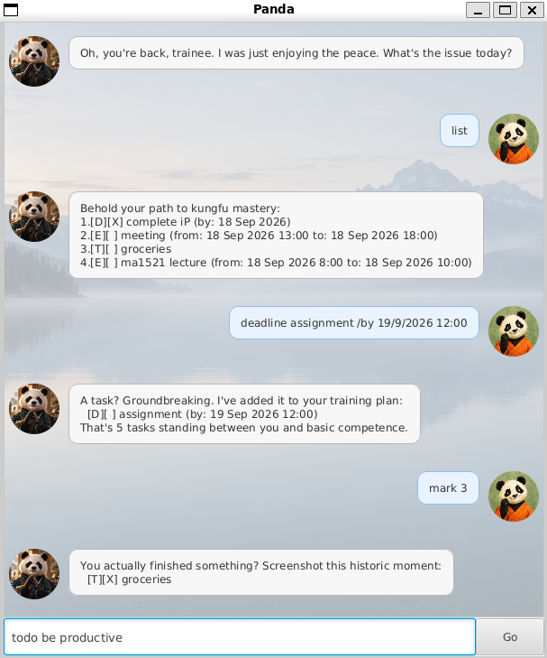

# Panda User Guide

Panda is a desktop application for managing daily tasks from the perspective of a kungfu trainee. Its gamified
experience turns each task into another step in the trainee's journey toward kungfu mastery, guided by a sarcastic
kungfu master.



## Table of Contents

- [Quick Setup Guide](#quick-setup-guide)
- [Getting Started](#getting-started)
- [Features at a Glance](#features-at-a-glance)
- [Command Summary](#command-summary)
- [Keeping Track of Tasks](#keeping-track-of-tasks)
- [Finding the Right Tasks](#finding-the-right-tasks)
- [Saving and Exiting](#saving-and-exiting)

## Quick Setup Guide

1. Install JDK 25 if it is not already installed.
2. Download the provided `panda.jar` file.
3. Open a terminal in the folder containing the downloaded file.
4. Run `java -jar panda.jar`.

The Panda window should appear after the application starts.

## Getting Started

After launching Panda, use the text box at the bottom of the window to enter commands.

On the first launch, Panda starts with an empty task list. On later launches, Panda restores the tasks saved during
your previous session.

Follow this short tutorial to learn the basic features.

1. **Add a task.**

   ```text
   todo practise kungfu
   ```

   Panda adds the task as incomplete.

2. **View the task and its number.**

   ```text
   list
   ```

   The new task is task `1` if your list was empty when you started.

3. **Mark the task as done.**

   ```text
   mark 1
   ```

   Its status changes from `[ ]` to `[X]`.

4. **Unmark the task.**

   ```text
   unmark 1
   ```

   Its status changes back from `[X]` to `[ ]`.

5. **Delete the task.**

   ```text
   delete 1
   ```

   Panda removes it from the list.

Dates must use `d/M/yyyy`. To include a time, use `d/M/yyyy H:mm` with a 24-hour clock.

## Features at a Glance

- [Add to-dos](#adding-a-to-do) for tasks without dates.
- [Add deadlines](#adding-a-deadline) with due dates or due times.
- [Schedule events](#adding-an-event) with start and end dates or times.
- [View all tasks](#viewing-all-tasks) in a numbered list.
- [Mark tasks](#marking-a-task-as-done) as completed and [unmark tasks](#marking-a-task-as-not-done) that are not done.
- [Delete tasks](#deleting-a-task) and automatically renumber the remaining list.
- [Search descriptions](#searching-task-descriptions) for a whole word or phrase, case-insensitively.
- [View today's schedule](#checking-todays-schedule) of deadlines and events.
- [Check another date](#checking-another-date) for deadlines and events.
- [Resolve event clashes](#handling-schedule-clashes) while allowing back-to-back events.
- [Keep original task numbers](#searching-task-descriptions) in search results and dated task views.
- [Save changes automatically](#saving-and-exiting), restore tasks at startup, and confirm before closing.
- Explain invalid commands and recoverable errors without closing the application.

## Command Summary

| Command | Description |
| --- | --- |
| `todo DESCRIPTION` | Adds a task without a date or time. |
| `deadline DESCRIPTION /by DATE` | Adds a task with a due date or date-time. |
| `event DESCRIPTION /from START /to END` | Adds an event with a start and end. |
| `list` | Displays every task and its task number. |
| `mark TASK_NUMBER` | Marks a task as done. |
| `unmark TASK_NUMBER` | Marks a task as not done. |
| `delete TASK_NUMBER` | Deletes a task. |
| `find KEYWORD` | Finds tasks containing a whole word or phrase. |
| `today` | Displays deadlines and events occurring today. |
| `display /date DATE` | Displays deadlines and events occurring on a date. |
| `bye` | Saves the task list and requests confirmation to exit. |

Leading and trailing whitespace is ignored. Commands and their required markers, such as `/by`, `/from`, `/to`, and
`/date`, must otherwise follow the formats shown above.

## Keeping Track of Tasks

### Adding a to-do task

Use a to-do for something that has no fixed date or time. To-dos appear with the `[T]` label.

1. Decide on a short description of the todo.
2. Enter the following command, replacing the description of the todo task:

   ```text
   todo borrow a library book
   ```

3. Submit the command. Panda confirms that it is added as an incomplete task.

### Adding a deadline task

Use a deadline for work that needs to be completed by a particular date or time. Deadlines appear with the `[D]` label.

1. Decide on the task description and its due date.
2. Enter a deadline with a date only:

   ```text
   deadline submit report /by 21/9/2026
   ```

   Alternatively, include a time:

   ```text
   deadline submit report /by 21/9/2026 17:30
   ```

3. Submit the command. Panda confirms that it is added as an incomplete task.

### Adding an event

Use an event for an activity that occupies a period of time. Events appear with the `[E]` label.

1. Decide on the event description, start, and end.
2. Enter the event:

   ```text
   event project meeting /from 21/9/2026 14:00 /to 21/9/2026 16:00
   ```

3. Submit the command. Panda confirms that it is added as an incomplete task.

The event must end after it starts. Panda rejects an event that overlaps an existing event, even if the existing event
is marked as done. However, back-to-back events are allowed.

For a multi-day event, dates may be entered without times. A date-only event blocks out the entire day of days between
the from and to dates, inclusive.

For example, if an event is stored to be happening from 19/9/2026 to 20/9/2026, Panda blocks out the time period from
19/09/2026 00:00 to 20/09/2026 23:59. The next event can only start from 21/9/2026 00:00.

### Viewing all tasks

Use the task list to review your work and find the task number of each task.

1. Enter:

   ```text
   list
   ```

2. Submit the command. Panda displays every task with a task number.
3. Note the number of any task you want to mark, unmark, or delete. After deleting a task, run `list` again because
   Panda renumbers the remaining tasks.

### Marking a task as done

Mark a task when you complete it. Its status changes from `[ ]` to `[X]`.

1. Enter `list` and find the completed task's number.
2. Enter `mark` followed by that number:

   ```text
   mark 2
   ```

3. Submit the command. Panda confirms the updated task. If the number does not exist or the task is already marked,
   Panda explains the problem without changing the list.

### Marking a task as not done

Unmark a task if it was marked by mistake or needs more work. Its status changes from `[X]` to `[ ]`.

1. Enter `list` and find the marked task's number.
2. Enter `unmark` followed by that number:

   ```text
   unmark 2
   ```

3. Submit the command. Panda confirms the updated task. If the number does not exist or the task is already unmarked,
   Panda explains the problem without changing the list.

### Deleting a task

Delete a task when you no longer need it. The remaining tasks are renumbered automatically.

1. Enter `list` and find the unwanted task's number.
2. Enter `delete` followed by that number:

   ```text
   delete 3
   ```

3. Submit the command. Panda identifies the removed task and reports the new task count.
4. Enter `list` again to see the updated numbers. If you deleted an event, its scheduled time is now available.

## Finding the Right Tasks

### Searching task descriptions

Search for a whole word or phrase when you remember a task's description but not its number. Matching is
case-insensitive.

1. Choose a word or phrase from the description.
2. Enter `find` followed by that text:

   ```text
   find project meeting
   ```

3. Submit the command. Panda displays matching tasks with their original numbers from the full list.
4. Use a result's number with `mark`, `unmark`, or `delete` if needed.

### Checking today's schedule

Use the daily view to focus on deadlines and events occurring today. To-dos are not included because they have no date.

1. Enter:

   ```text
   today
   ```

2. Submit the command. Panda displays today's deadlines and events with their original task numbers.
3. Use a displayed number to update or delete a task if needed.

### Checking another date

Use a date view to plan ahead or review an earlier day.

1. Choose a date in `d/M/yyyy` format.
2. Enter the date after `display /date`:

   ```text
   display /date 21/9/2026
   ```

3. Submit the command. Panda displays deadlines due that day and events occurring at any point during it.
4. Use the original task numbers shown in the results to update or delete tasks. Events spanning several days appear
   on every date they occupy.

## Handling Schedule Clashes

When a new event overlaps one or more existing events, Panda rejects it and lists the conflicting events in time order.
Resolve the clash by moving the new event or removing an obsolete one.

1. Read Panda's response and note the numbers and times of the conflicting events.
2. Decide whether to keep the existing events. To remove one, enter `delete` followed by its task number:

   ```text
   delete 3
   ```

3. Enter the new event again with an available time:

   ```text
   event project meeting /from 21/9/2026 16:00 /to 21/9/2026 18:00
   ```

4. Submit the command and check that Panda confirms the event.

Marked events still reserve their time. Marking an event records completion; it does not remove the event from the
schedule.

## Saving and Exiting

Panda saves the task list automatically after you add, mark, unmark, or delete a task. It also performs a final save
before asking you to confirm that you want to exit.

1. Enter the exit command, or use the window's close button:

   ```text
   bye
   ```

2. Wait for Panda to perform the final save and open the confirmation dialog.
3. Choose **LET ME OUT!** to exit, or choose **Oops no** to return to Panda.
4. When Panda is opened again, the saved tasks will be restored. 

Panda loads the saved tasks automatically on start. If it cannot read the saved data, it reports the
problem and starts with an empty task list.
